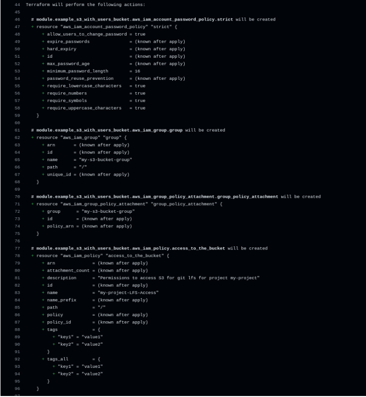
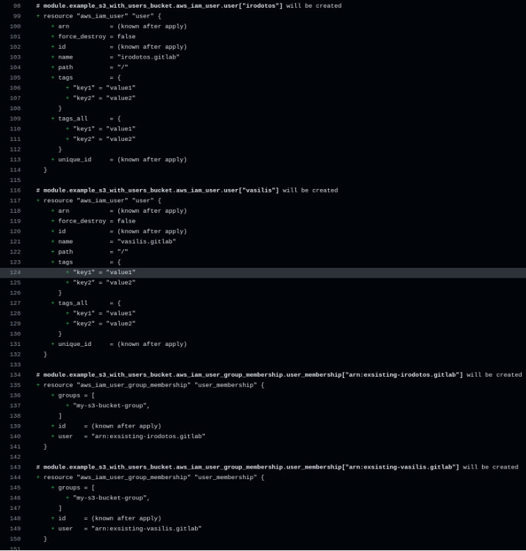
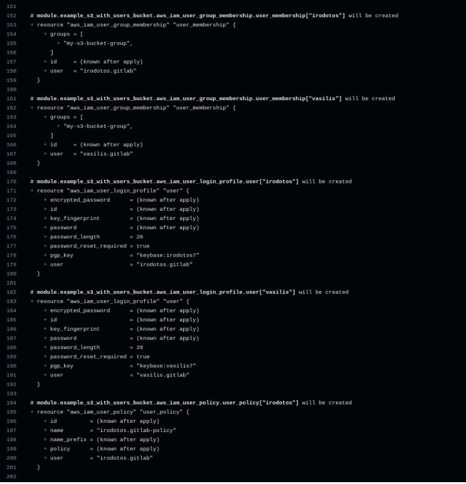
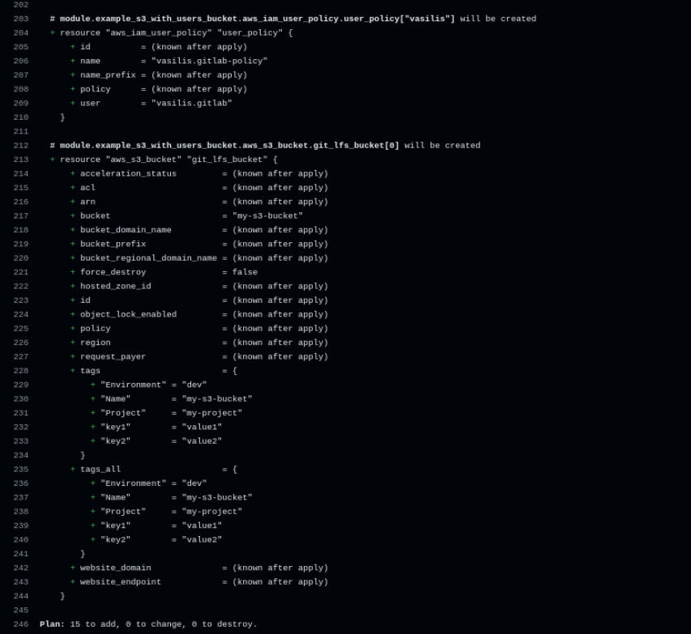
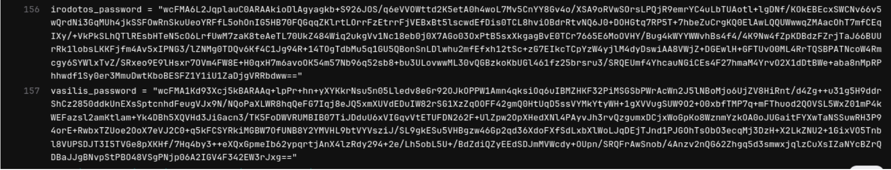
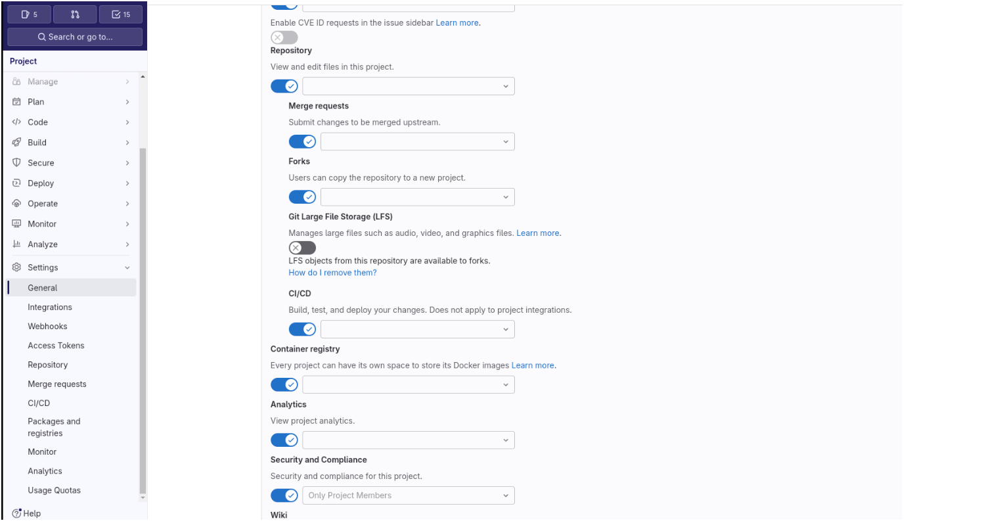

## Setting the scene

Are you running into storage limits and high costs with GitLab LFS? In this post, I’ll show you how we migrated our large game assets from GitLab LFS to Amazon S3, saving money and reducing management overhead.


Public hosting providers often give you limited free storage for large artifacts (textures, animations, 3D assets). We had the same issue at Vaslabs, so we decided to dive deep and remove this obstacle from our development pipeline!

In this blog post, I'll walk you through the steps we took to migrate from GitLab LFS to Amazon S3, which helped us significantly reduce costs and management overhead for our game assets. The process involved setting up a Terraform project, creating and configuring an S3 bucket, managing user permissions, and using lfs-dal to reroute Git LFS traffic to S3.


## The Problem

Git providers offer limited free storage space for repositories. Once you exceed this limit, you must pay to continue using the service. This can become costly, especially for small video game companies or individual developers who need to store numerous assets, animations, and 3D models.


## The Solution

At Vaslabs, we’re Linux and FOSS enthusiasts. To help the community, we created a [Git S3 LFS Terraform module](https://github.com/vaslabs-ltd/git-s3-lfs) that automates the setup of S3 buckets and IAM users for storing your assets. This way, you avoid storage limits and reduce costs.

That's why we made this project: to minimize your development effort and help you get your own cheap and flexible LFS storage.


## Step 1: Set Up the Terraform Project

The first step in our migration journey was to set up the Terraform project. [Terraform](https://www.terraform.io/) is an excellent tool for managing infrastructure as code, and it allowed us to ensure everything was set up correctly before making any changes.

Initialize the Terraform project:

```bash
terraform init
```


Create the Terraform configuration files (`main.tf`) to define the necessary resources, including the S3 bucket and IAM users. You can find an example [main.tf here](https://github.com/vaslabs-ltd/git-s3-lfs/blob/main/s3_and_users_service/main.tf).

Create the `variables.tf` file to allow some configurability, but with sane defaults so you can get started quickly. See [variables.tf example](https://github.com/vaslabs-ltd/git-s3-lfs/blob/main/s3_and_users_service/variables.tf).

https://github.com/vaslabs-ltd/git-s3-lfs/blob/main/s3_and_users_service/variables.tf


You can use the provided Terraform files as a reusable module to create the S3 bucket and users:

```hcl
module "s3_bucket" {
  source         = "PATH-TO-THE-PREVIOUS-FILES-DIRECTORY"
  s3_bucket_name = "my-s3-bucket"
  environment    = "dev"
  project_name   = "my-project"
  new_users = {
    "irodotos" : {
      "iam" : "irodotos.gitlab"
      "keybase" : "irodotos7"
    },
    "vasilis" : {
      "iam" : "vasilis.gitlab"
      "keybase" : "vasilis7"
    }
  }
  tags = {
    key1 = "value1"
    key2 = "value2"
  }
}
```


**Important Notes:**

Before you run it, make sure that every new user has a [Keybase account](https://keybase.io/) and that each has uploaded their public key to the Keybase app so it will be visible.

Run the Terraform plan to ensure the configuration is correct:

```bash
terraform plan
```










Apply the Terraform plan to create the resources:

```bash
terraform apply
```




The output of the Terraform apply is the encrypted password for each of the IAM users. Each user needs to take this encrypted password and decrypt it using their own private key from Keybase. After decryption, take the password and log in to your new AWS IAM user.

Take a close look at the examples and test directories to understand how to configure the variables correctly. You can also use existing users if you don't want to create new ones, and you can use your own S3 bucket if you have one.

## Step 2: IAM User Login and Access Keys

Every new user needs to log in with their IAM permissions and create access keys (you will need them for Git LFS access).

## Step 3: Disable GitLab LFS and Configure lfs-dal

With the S3 bucket and IAM users set up, the final step is to disable GitLab LFS and configure Git to use S3 instead.

1. Disable GitLab LFS in the GitLab project settings to ensure no new files are uploaded to GitLab's LFS.

  

2. Configure lfs-dal by following the steps in the [lfs-dal repository](https://github.com/regen100/lfs-dal.git).

---

By following these steps, we successfully migrated from GitLab LFS to S3, reducing our storage costs significantly. The process involved careful planning and execution, but the cost savings make it worthwhile. Additionally, we've reduced the management overhead since we no longer need to monitor and purchase additional GBs of storage frequently. The scalability of S3 ensures that our storage needs are met without constant manual intervention.

## Conclusion

Migrating from GitLab LFS to S3 can save you money and give you more control over your assets. If you have any questions or run into issues, please leave a comment below!